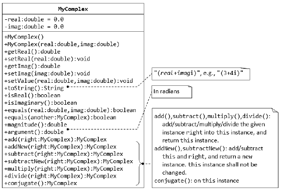
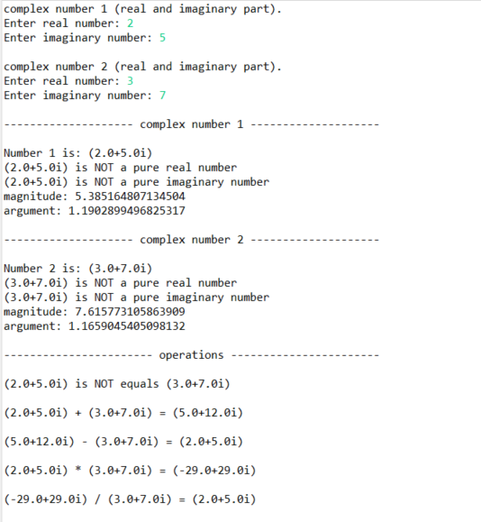

<h1 align = "center" > Complex Number </h1>

### The UML MyComplex class shown below is for the complex number representation.

 

 

A class called MyComplex, which models complex numbers x + yi, is designed as shown in the class diagram given above. It contains:
* Two instance variables named real (double) and imag (double) which stores the real and imaginary parts of the complex number, respectively.
1. A constructor that creates a MyComplex instance with the given real and imaginary values.

2. A default constructor that creates a MyComplex at 0.0 + 0.0 i.

3. Getters and setters for instance variables real and imag.

4. A method setValue() to set the value of the complex number (both real and imaginary parts)

5. Methods isReal() and isImaginary() that returns true if this complex number is real or imaginary, respectively.

6. A method equals(double real, double imag) that returns true if this complex number is equal to the given complex number (real, imag).
a. Hints:
b. return (this.real == real && this.imag == imag);

7. Methods add(MyComplex right) and subtract(MyComplex right) that adds
and subtract the given MyComplex instance (called right), into/from this
instance and returns this instance.
(a + bi) + (c + di) = (a+c) + (b+d)i
(a + bi) - (c + di) = (a-c) + (b-d)i

 

 

### **requirements:**
* MyComplex class.
* A test driver class to test all public methods defined in (number 1 - 7). 
* application called MyComplexApp that uses the MyComplex class.
The application shall prompt the user to enter two complex numbers, print
their values, check for real, imaginary and equality, and carry out all the
arithmetic operations ( Add and Subtract) mentioned above.

Note: exist some operations in this project not mentioned (magnitude, argument...)

 

 

### **Simple Output**

